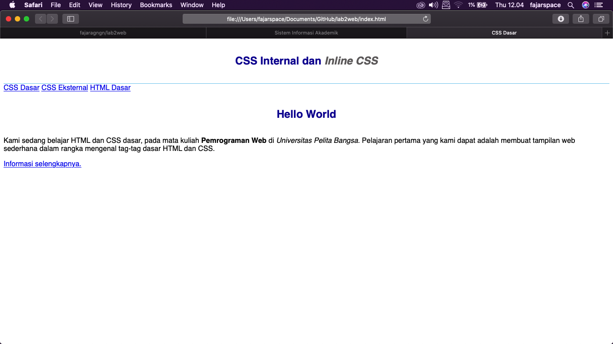
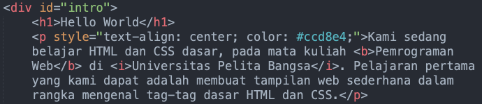
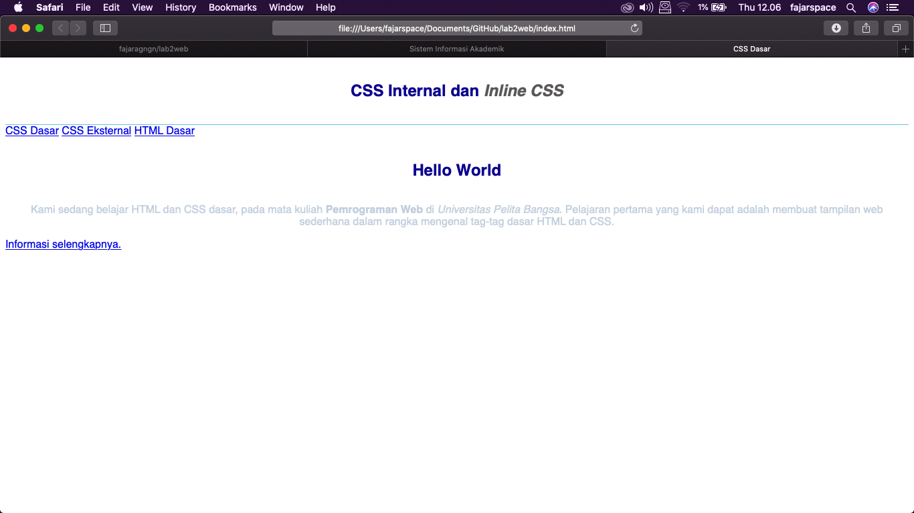
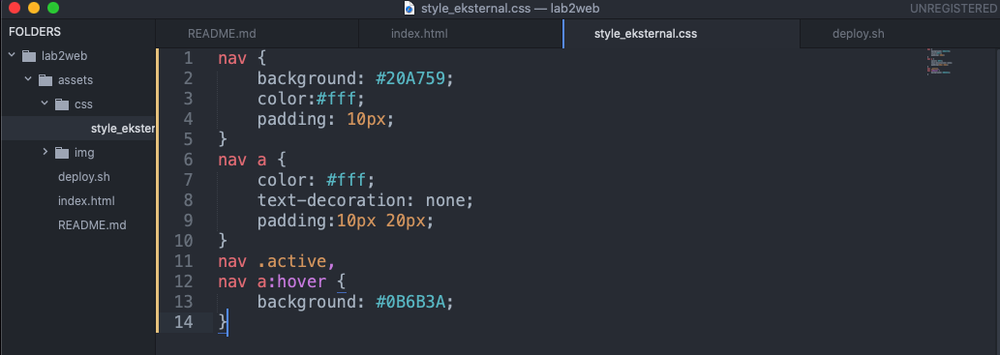
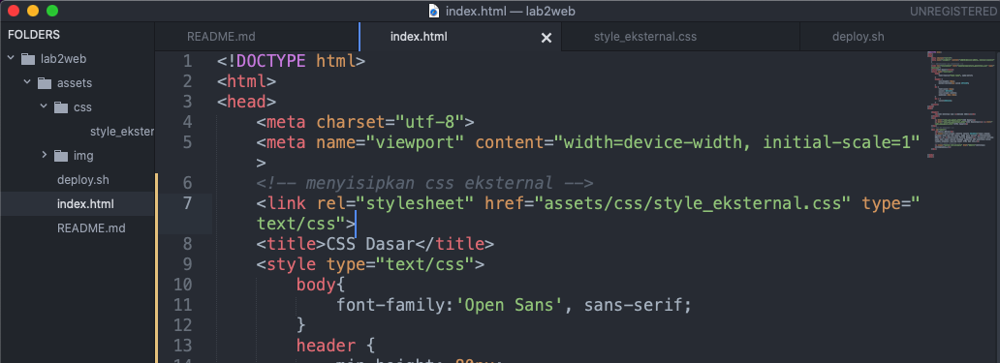
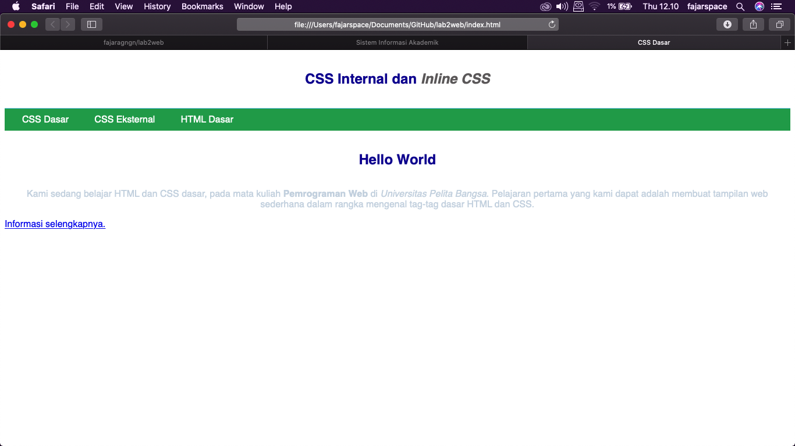
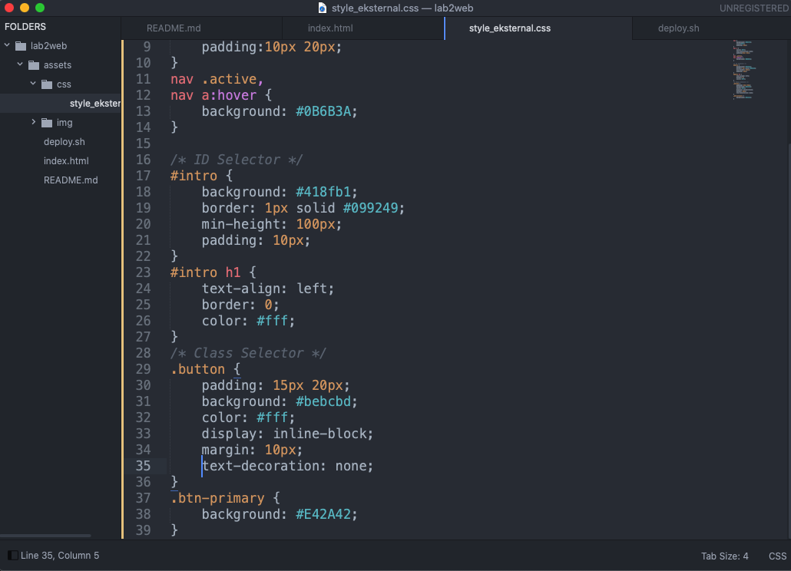
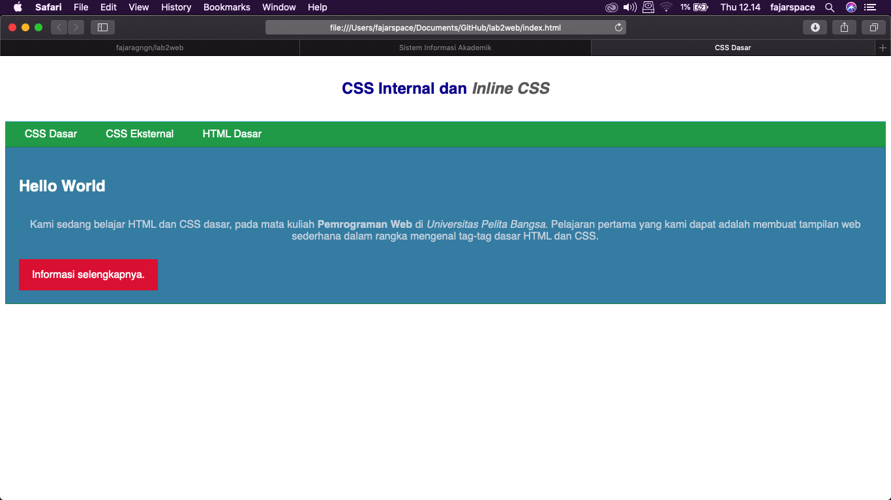

| Nama      | Fajar Agung Nugroho |
| ----------- | ----------- |
| NIM     | 312010448       |
| Kelas   | TI.20.A.1        |

## Langkah langkah praktikum
Membuka text editor, Saya menggunakan Sublime text

## 1. Membuat Dokumen HTML

Buka pada browser untuk melihat hasilnya

## 2. Mendeklarasikan CSS Internal

simpan perubahan yang ada, dan lakukan refresh pada browser untuk melihat hasilnya

## 3. Menambahkan Inline CSS
tambahkan deklarasi inline CSS pada tag `
` seperti berikut

Refresh kembali browser untuk melihat perubahannya

## 4. Membuat CSS Eksternal
Buatlah file baru dengan nama style_eksternal.css kemudian buatlah deklarasi CSS seperti berikut

Kemudian tambahkan tag `<link>` untuk merujuk file css yang sudah dibuat pada bagian `<head>`

Selanjutnya refresh kembali browser untuk melihat perubahannya.

## 5. Menambahkan CSS Selektor
Selanjutnya menambahkan CSS Selector menggunakan ID dan Class Selector. Pada file style_eksternal.css, tambahkan kode berikut

Kemudian simpan kembali dan refresh browser untuk melihat perubahannya

## Pertanyaan dan Tugas
1. Lakukan eksperimen dengan mengubah dan menambah properti dan nilai pada kode CSS dengan mengacu pada CSS Cheat Sheet yang diberikan pada file terpisah dari modul ini.
2. Apa perbedaan pendeklarasian CSS elemen h1 {...} dengan #intro h1 {...}? berikan penjelasannya!
3. Apabila ada deklarasi CSS secara internal, lalu ditambahkan CSS eksternal dan inline CSS pada elemen yang sama. Deklarasi manakah yang akan ditampilkan pada browser? Berikan penjelasan dan contohnya!
4. Pada sebuah elemen HTML terdapat ID dan Class, apabila masing-masing selector tersebut terdapat deklarasi CSS, maka deklarasi manakah yang akan ditampilkan pada browser? Berikan penjelasan dan contohnya! ( `
` )

## Jawab
1. aowkoakwoaowko nungguin ya
